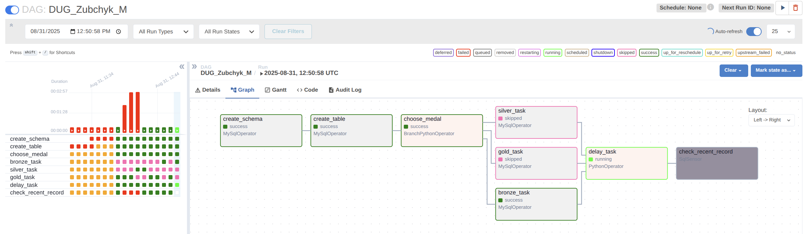
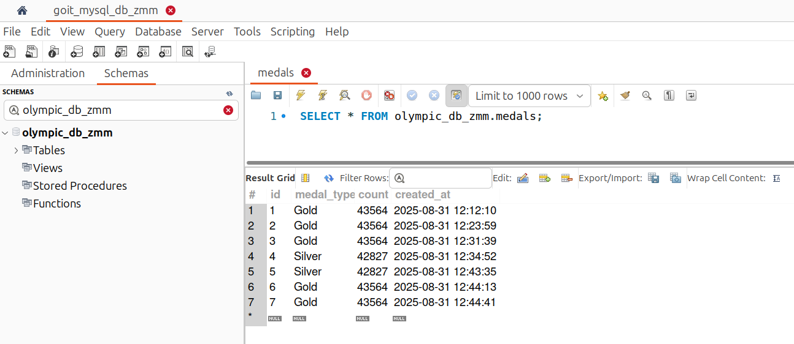

# [Домашнє завдання до теми «Apache Airflow»](https://www.edu.goit.global/learn/25315460/26851475/28852155/homework)

## Опис домашнього завдання
Реалізувати DAG із використанням вивчених операторів, щоб виконати певний перелік прикладних завдань.

### Покрокова інструкція виконання
Напишіть DAG, що має такі завдання (кожен пункт → одне завдання/task):


1. Створює таблицю.
    ```
    Використайте IF NOT EXISTS з полями
    id (автоінкремент, головний ключ),
    medal_type,
    count,
    created_at.
    ```
2. Випадково обирає одне із трьох значень `['Bronze', 'Silver', 'Gold']`.
3. Залежно від обраного значення запускає одне із трьох завдань (розгалуження).
4. Опис трьох завдань:
    1) Завдання рахує кількість записів у таблиці `olympic_dataset.athlete_event_results`, що містять запис `Bronze` у полі `medal`, та записує отримане значення в таблицю, створену в пункті 1, разом із типом медалі та часом створення запису.

    2) Завдання рахує кількість записів у таблиці `olympic_dataset.athlete_event_results`, що містять запис `Silver` у полі `medal`, та записує отримане значення в таблицю, створену в пункті 1, разом із типом медалі та часом створення запису.

    3) Завдання рахує кількість записів у таблиці `olympic_dataset.athlete_event_results`, що містять запис `Gold` у полі `medal`, та записує отримане значення в таблицю, створену в пункті 1, разом із типом медалі та часом створення запису.
5. Запускає затримку виконання наступного завдання. Використайте `PythonOperator` із функцією `time.sleep(n)`, якщо одне з трьох попередніх завдань виконано успішно.
6. Перевіряє за допомогою сенсора, чи найновіший запис у таблиці, створеній на етапі 1, не старший за 30 секунд (порівнюючи з поточним часом). Ідея в тому, щоб упевнитися, чи справді відбувся запис у таблицю. За допомогою задачі затримки на етапі 5 ви можете створити затримку 35 секунд для того, щоб упевнитися, що сенсор справді «падає», якщо затримка більша за 30 секунд.

### Критерії прийняття

1. Створення таблиці (10 балів).
2. Генерація випадкового значення (10 балів).
3. Розгалуження: запуск одного із трьох завдань залежно від обраного значення (15 балів).
4. Виконання завдань з рахування кількість записів у таблиці (25 балів).
5. Реалізація затримки виконання наступного завдання (15 балів).
6. Перевірка, чи найновіший запис у таблиці не старший за 30 секунд (25 балів).

### Результат

1. 
2. 

### Ресурси

- [script](./scripts/DUG_Zubchyk_M.py)
- [airflow.goit.global](https://airflow.goit.global/dags/DUG_Zubchyk_M/grid)
- [airflow sandbox repo](https://github.com/goitacademy/airflow_sandbox/actions/runs/17357257342)

### Репозиторій
[goit-de-hw-07](https://github.com/nickolas-z/goit-de-hw-07)